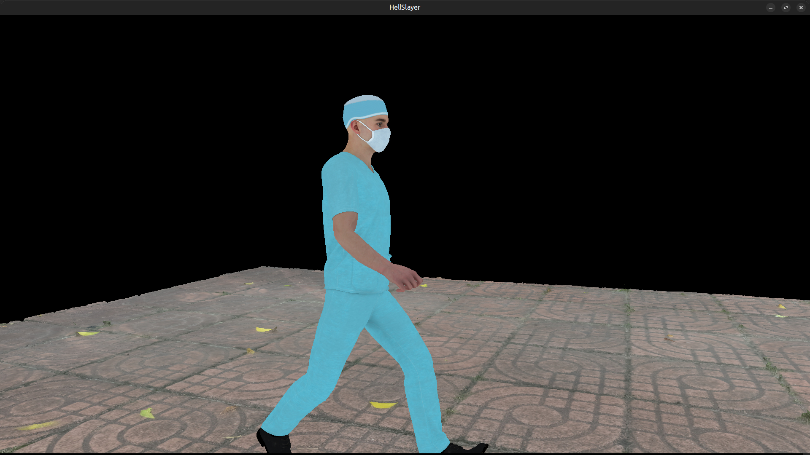
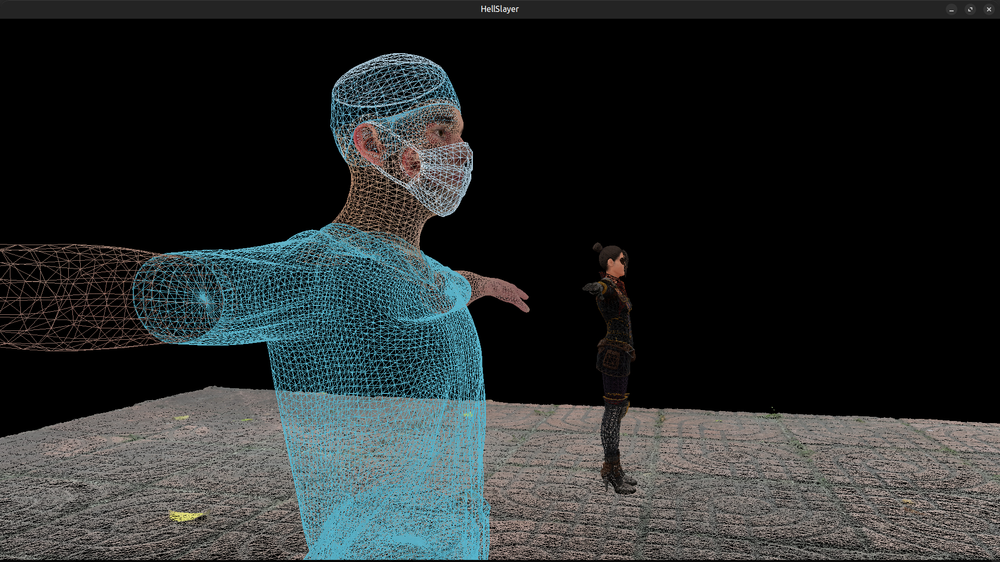

# **HellSlayer**
> An Engine + Game Made From Scratch In OpenGL & C++




## Current Features
- A 3D renderer 
- Supports multiple model loading
- Supports skeletal animation (With GPU-Skinning)
- A free-fly camera for navigating (WASD-keys)
- [T] : To enter into wireframe mode
- [Y] : To return into normal mode

## Future Development
- Finite State Machine for character controller
- Lighting (PHONG)

## Usage
> Currently Linux only build, you can modify and run on windows if you set the build system right.
- Make sure you've 'assimp' and 'glfw' configured int your system.

1. clone
```
git clone https://github.com/AayushBade14/HellSlayer.git

cd HellSlayer

```
2. build
```
make
```
3. run
```
./Build/hell
```
4. clean-build
```
make clean
```


